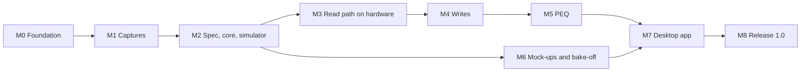

# cherrytop implementation plan

Written 2026-10-04 from the 125 decisions in [decisions.md](decisions.md), which the
maintainer reviewed and accepted the same day. Question numbers (Q51) point into that
file; ADR numbers point into [adr/](adr/).

Nothing in this plan starts until the maintainer approves it. Nothing is ever sent to a
real device except through the gated runner, on the maintainer's go-ahead.

## What 1.0 is

- `cherryctl`: one small executable that reads and controls a Topping DX5 II from the
  command line, with stable JSON output for scripting.
- `cherrytop`: a desktop app with a draggable PEQ curve, a profile library and every
  device setting, at least equal to Topping's Home WEB.
- Verified on real hardware on Windows and Linux. macOS builds are experimental.
- An open, documented protocol spec that every claim can be traced back through.

Out of scope for good: firmware update, factory reset, accounts, cloud sync, control over
Bluetooth, serving the UI to the network. Dropped unless a need appears: a TUI.

## Rules that hold in every phase

1. **Captures first.** No command shape is sent to a real device unless it was seen in a
   capture of Topping's own software talking to that model (ADR 0005).
2. **The core guards every write.** Range checks, the level-increase guard, the muted
   whole-profile apply and the firmware gate live in the core, so no surface can bypass
   them (ADR 0002).
3. **Unverified models get no traffic at all** (ADR 0004).
4. **Hardware runs are gated.** The maintainer starts each one. The first live run of each
   new write command happens with the maintainer present, at or below −60 dB, with
   nothing valuable connected, and it restores the prior state.
5. **Evidence, not claims.** Every phase ends with something checked into the repo: test
   output from CI, a hardware-run report, or a measurement.
6. **No human code review.** Tests, the simulator, mutation testing and a fresh-context
   review agent stand in for it. Substantive changes go through pull requests so the
   history shows the review.

## Shape of the code

One deep module, the core, behind a small interface. Everything else is thin.

| Path | What it is |
|---|---|
| `crates/cherrytop-core/` | Frame codec, units, device definition, session state machine, write-safety contract, PEQ maths, profile and snapshot formats. No I/O (Q26). |
| `crates/cherrytop-hid/` | Finds and identifies devices from OS descriptors, moves 16-byte frames, holds the operation lock (Q31, Q48–Q52). |
| `crates/cherrytop-sim/` | Simulator and capture replay (Q50, Q74). |
| `crates/cherryctl/` | The CLI (Q80–Q91). |
| `apps/cherrytop/` | The desktop app, in the toolkit the bake-off picks. |
| `tools/` | Capture logger, capture scrubber, hardware runner, budget measurement scripts. |
| `captures/<model>/<firmware>/` | Ground-truth captures, serials replaced (Q71). |
| `verification/` | Hardware-run reports and measurements, by date, OS and commit. |
| `docs/protocol/` | The spec, written from the captures. |

There is one seam that matters: the transport. Three adapters sit at it from the start
(real HID, simulator, capture replay), which is what lets every surface be tested without
hardware.

## Order of work

M6 runs alongside M3–M5: it needs only the simulator.

## M0. Foundation

**Goal:** a repo that builds and tests an empty workspace on three operating systems.

**Work**

- `LICENSE-MIT`, `LICENSE-APACHE`, and a CC BY 4.0 notice for `docs/` (ADR 0007).
- `AGENTS.md` with the hardware rules above, so every agent session starts from them
  (Q125).
- Cargo workspace with the four crates as skeletons; pinned toolchain; formatting and
  lint settings; a licence and advisory check (Q120, Q121).
- CI on Windows, Linux and macOS: format, lint, test, licence check.

**Done when:** CI is green on all three for a trivial test.

## M1. Captures

**Goal:** ground truth for firmware 2.53, before any protocol code is written.

**Work**

- `tools/capture/`: our own logging snippet for Chrome's developer tools, recording both
  directions with timestamps as JSON lines (Q70, Q71).
- `docs/protocol/capture-checklist.md`: one control at a time, every value of every
  setting, plus connect, idle, changes made with the knob and remote while connected,
  standby, and disconnect (Q72).
- A scrubber that replaces serial-number replies and checks each file is well formed
  (Q42).

**Maintainer:** runs the capture sessions on Topping's Home WEB with the DX5 II,
following the checklist.

**Done when:** `captures/dx5ii/fw2.53/` covers the checklist and every file passes the
scrubber.

**Settles:** whether writes are echoed (Q36); whether the DAC announces changes while a
host is connected (Q40); how Topping's app reads PEQ back (Q19); when the heartbeat is
used (Q41); the vendor's preamp rounding (Q30); the value ranges and the pass and notch
filter values (Q93, Q95); how preset slots are selected (Q97); how many frames a settings
read takes (Q111).

## M2. Spec, core and simulator

**Goal:** a core that reproduces every capture, proven without hardware.

**Work**

- `docs/protocol/spec.md`, written from the captures, each statement citing a capture
  file (ADR 0007).
- Core: frame codec and validation (Q37, Q38); unit types with exact decimal parsing
  (Q28, Q29); the DX5 II device definition as compiled tables, with factory reset and
  firmware update impossible to encode (Q33, Q34); typed state with "unknown" as a value
  (Q39); the session state machine with one request in flight (Q35, Q57).
- Simulator and capture replay.
- Tests: golden re-encoding of every captured frame (Q73); simulator fidelity against
  every capture (Q74); property tests (Q75); a fuzz target for the decoder (Q76).

**Done when:** every captured frame decodes and re-encodes to identical bytes, the
simulator reproduces the device's side of every capture, and CI is green on three OSes.

## M3. Read path on hardware, and `cherryctl` 0.1

**Goal:** read the real device on Windows and Linux, and settle the facts the
architecture rests on.

**Work**

- HID transport: identification from OS descriptors, the Windows report-ID byte, shared
  open, reader thread with a latest-value mailbox for meters, the operation lock
  (Q31, Q49, Q51, Q52, Q56).
- The hardware runner: refuses to start above −60 dB or without a typed confirmation,
  and writes a report into `verification/` (Q78).
- `cherryctl` read-only commands: `devices`, `status`, `get`, `keys`, `watch`,
  `snapshot`, `doctor`, with `--json` and the fixed exit codes (Q80–Q87).
- Linux udev rule under `packaging/linux/`, explained by `doctor`.
- A spike of `async-hid` behind the same seam, compared with `hidapi` (Q48).

**Hardware runs (maintainer present), on Windows and then on Linux:**

1. Listen only: open the interface, send nothing, turn the knob and press the remote.
2. Reads only: the reads Topping's app sends on connect; cross-check the firmware
   version; measure how long `status` takes.
3. Two handles: two processes open the device, one sends a read, both must see the
   reply.

**Done when:** reports for both OSes are in `verification/`, and `cherryctl` 0.1 is
released as a read-only pre-release.

**Settles:** change notifications without a host app (Q40); whether the device streams
when idle (Q113); the firmware mapping (Q32); the 100 ms budget for reads (Q111); and the
two-handle assumption behind ADR 0006. If the two-handle test fails, an owner process is
added behind the transport seam before M4 (Q53).

## M4. Writes under the safety contract, and `cherryctl` 0.2

**Goal:** every control and setting writable from the CLI, with the guards proven.

**Work**

- Safety module in the core: range checks; the level-increase estimate and its 10 dB
  threshold (Q58, Q59); the 20 dB/s ramp (Q60); the ceiling (Q61); the volume unit read
  once per operation (Q63); echo and read-back confirmation (Q36); the unverified-firmware
  gate and opt-in (Q68); disruptive writes (Q46); scenes (Q47); the write log (Q69).
- CLI: `set`, `volume`, `mute`, `input`, `output`, `apply -f` with a plan and
  `--dry-run`, `log`, and the guard prompt (Q62, Q82–Q84).
- Tests: property tests on the guards; mutation testing on the safety and codec modules,
  where deleting a guard must fail a test (Q77).
- A fresh-context review agent audits the write path against ADR 0002 (Q123).

**Hardware runs (maintainer present for each new command), least hazardous first:**
mute; one volume step down and up; balance; PCM filter; crossfeed; PEQ on/off; display
settings; input; then, with nothing connected, headphone gain, output, and line-out mode;
last the USB audio mode, which makes the device reconnect. Each run restores the prior
state. One run checks that settings survive a power cycle (Q101). Scene save is tested
only once the maintainer agrees to overwrite a slot.

**Done when:** reports for both OSes exist, the mutation run is clean, and `cherryctl`
0.2 is released.

## M5. PEQ, and `cherryctl` 0.3

**Goal:** profiles applied safely, and the curve maths checked against the real device.

**Work**

- PEQ module in the core: filter maths (Q92); summed response, headroom and automatic
  preamp (Q64, Q65); the profile file and its checks against device limits (Q94, Q95);
  the muted whole-profile apply (Q66); live-edit ordering (Q67); linked and separate
  channels (Q96); the last-written fingerprint (Q19); level-matched A/B (Q100).
- Import and export of EqualizerAPO/AutoEQ and REW filter text (Q18).
- AutoEQ lookup by headphone name, as an explicit network action with a local cache
  (Q17). The data's licence terms are checked before this is built.
- CLI: `peq show`, `apply`, `import`, `export`, `check`, `convert`, `list`.

**Hardware runs (maintainer present):** the first live band write and the first
whole-profile apply; then a loopback sweep for each filter type, comparing the measured
response with our curve (Q79). The tolerance is agreed before measuring; the proposal is
±0.25 dB from 20 Hz to 20 kHz.

**Done when:** reports and the measurement results are in `verification/`, and
`cherryctl` 0.3 is released.

## M6. Mock-ups and toolkit bake-off (alongside M3–M5)

**Goal:** choose the look and the toolkit by evidence.

**Work**

- Two or three static mock-up directions in the precision-instrument style (Q14, Q110).
- The same thin slice (window, EQ curve with draggable bands, live volume readout against
  the simulator) in Slint, egui and Tauri 2, each with its renderer pinned and recorded
  (Q13, Q102, Q103).
- Measurements on the maintainer's Windows and Linux machines: cold start, memory of the
  whole process tree at idle, download size, frame rate while dragging.

**Maintainer:** picks the look, and breaks a tie between stacks that pass.

**Done when:** an ADR records the pick with the measurement table. If Slint wins, the
browser UI is dropped (Q12). If nothing passes, the gates are stretched as Q6 allows or
iced is tried.

## M7. Desktop app

**Goal:** the app, complete against the simulator and then on hardware.

**Work**

- Main window, settings view, keyboard map, truthful readouts, undo, demo mode, single
  instance (Q104–Q109, Q112).
- Profile library, A/B, import, AutoEQ search, snapshot and restore, hazard
  confirmations, the read-only banner.
- Live meters, off by default (Q113).
- Tests: UI logic headless against the simulator; screenshot tests of the curve; a manual
  checklist for look and feel.

**Done when:** a 0.9 beta runs on Windows and Linux, a hardware run confirms the app and
`cherryctl` work at the same time, and the budget scripts report against the Q6 gates.

## M8. Release 1.0

**Work**

- Budgets measured; any miss either fixed or recorded as an accepted stretch (Q111).
- Mutation testing and the review-agent audit repeated on the release commit.
- Packaging: winget and a portable zip for Windows; tarball and `.deb` with the udev rule
  for Linux; unsigned experimental builds for macOS (Q25).
- User guide, `SECURITY.md`, `CONTRIBUTING.md`, and the spec tidied for outside readers.

**Maintainer:** decides on Windows code signing, and gives the go to publish.

**Done when:** hardware-run reports exist for the release commit on Windows and Linux,
and the release gate in Q123 is met.

## After 1.0, in order

1. Resident mode: tray, hotkeys, rules, local API (Q21, Q114–Q117).
2. Scripting (Q118, Q119).
3. Browser UI, only if the app turned out to be web-based (Q12).
4. A second device, which is when the definition format is frozen (Q23).
5. Fitting an EQ to a custom target curve (Q17).

## What the maintainer has to do

| When | What |
|---|---|
| M1 | Run the capture sessions on Topping's Home WEB. |
| M3 | Start the listen-only, read-only and two-handle runs, on Windows and on Linux. |
| M4, M5 | Be present for the first live run of each write command; run the loopback sweep. |
| M6 | Pick the look; break a tie between toolkits. |
| M8 | Decide on code signing; approve the release. |

## Risks

| Risk | What limits it |
|---|---|
| A destructive command reaches the DAC | The encoder cannot produce one; devices are identified by product string; only captured shapes are sent; first live runs are attended. |
| Sudden loud output | The level-increase guard, the ramp, the muted profile apply, and hardware runs at or below −60 dB. |
| Topping changes the protocol in new firmware | Devices on unverified firmware are read-only by design; captures are redone per firmware. |
| Topping's web app changes or becomes unreachable | Capture broadly in M1 and keep the captures in the repo, with the web app version recorded. |
| The two-handle assumption is wrong | Tested in M3, before any write path depends on it; the fallback is an owner process behind the same seam. |
| `status` cannot meet 100 ms | Measured in M3; the gate is then scoped to single-value operations and recorded. |
| No toolkit passes the gates | Stretch as Q6 allows; iced is the alternate. |
| Bugs nobody reads | Golden tests on captures, mutation testing, review-agent audits. |
| The maintainer's time | Hardware steps are grouped so each sitting covers several. |
| Flash wear | Unknown. Nothing writes periodically, and live edits go no faster than Topping's app. |
| Provenance | The spec comes from our own captures (ADR 0007). This is not legal advice. |

## Open facts and where each is settled

| Fact | Settled in |
|---|---|
| Writes are echoed on firmware 2.53 | M1 |
| A complete PEQ profile can be read back | M1 |
| The vendor's preamp rounding | M1 |
| Value ranges for gain, Q and frequency | M1 |
| The DAC announces changes | M1 and M3 |
| The device revision is the firmware version | M3 |
| Every open handle receives every report on Windows | M3 |
| `status` fits in 100 ms | M3 |
| Mute is immediate and confirmable | M4 |
| Settings survive a power cycle | M4 |
| The level change between low and high gain | M4 |
| Our filter maths matches the device | M5 |
| The AutoEQ data's licence terms | M5 |
| macOS shows an Input Monitoring prompt | Not settled without a Mac; macOS stays experimental. |
